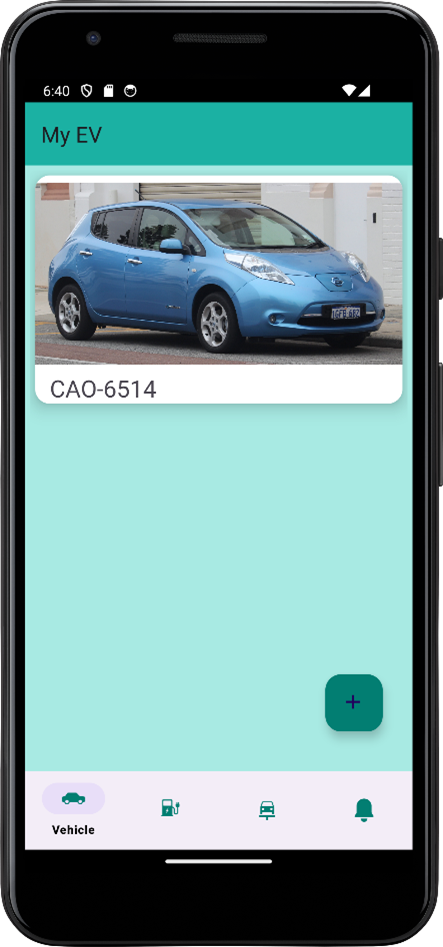
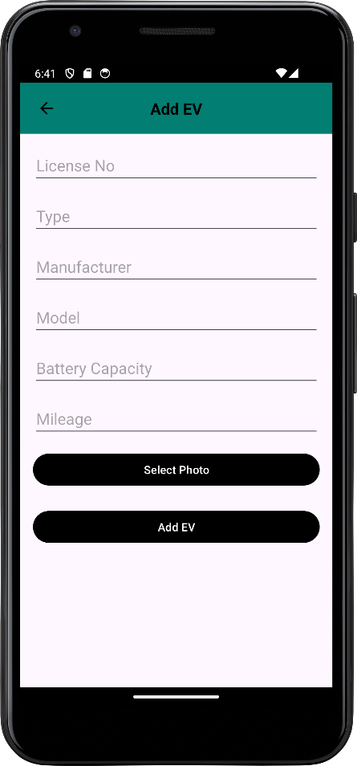
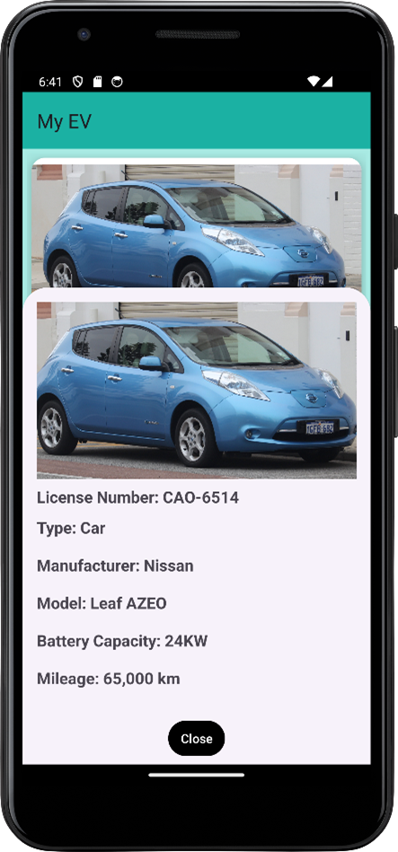
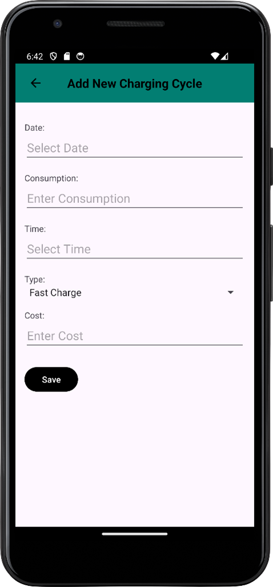
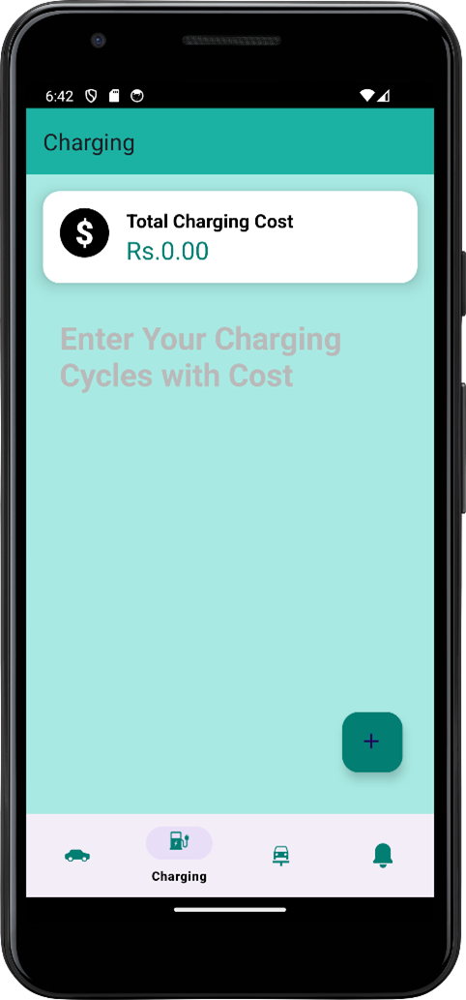
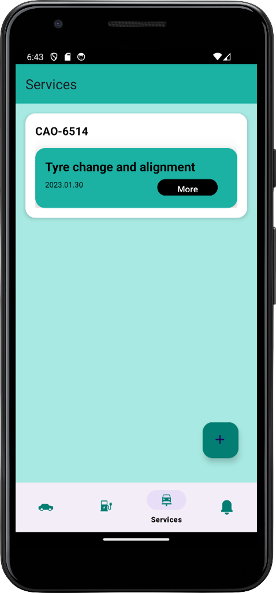
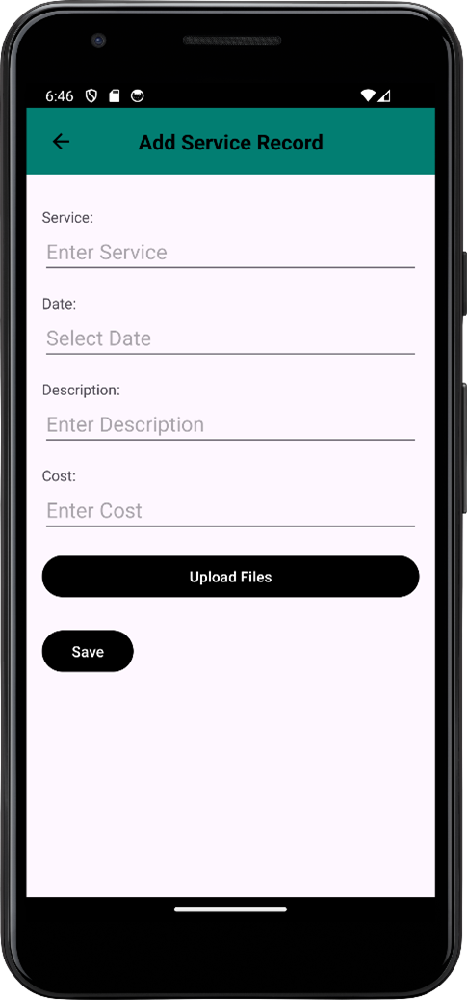
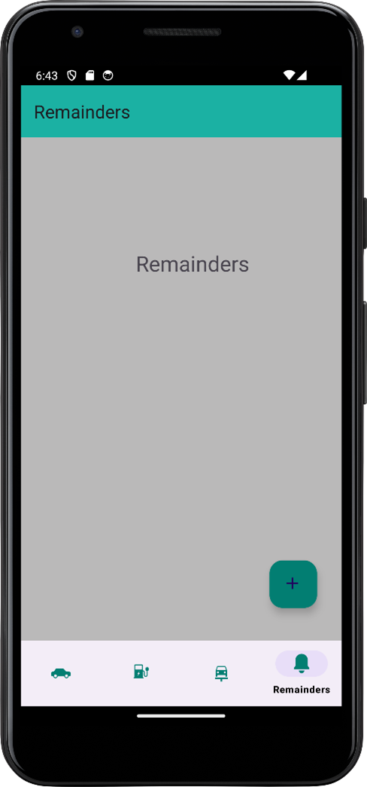
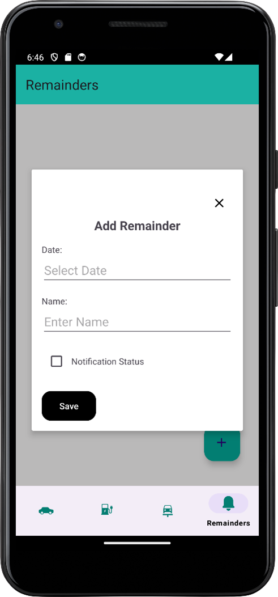

# MYEV (On going)
##EV vehicle maitainance record app

**MYEV** is a mobile productivity application designed to help electric vehicle (EV) owners track maintenance and operational costs. As the adoption of electric vehicles increases in Sri Lanka, there is a rising need for a dedicated tool to monitor EV-specific details. Unlike existing apps that focus on combustion vehicles, MYEV provides a tailored solution for managing EV maintenance, enhancing productivity for EV owners.

## Features

MYEV offers six core features for efficient EV maintenance:

- **Add a Vehicle**: Register EVs by providing details like brand, model, manufacture year, and battery capacity.
- **Record Charging Cycles**: Log and monitor each charging session.
- **Charging Cost Calculation**: Calculate and track the costs associated with each charging cycle.
- **Record Service History**: Maintain a detailed log of all service and maintenance activities.
- **Set Service Reminders**: Schedule reminders for upcoming services and maintenance tasks.
- **Multi-Vehicle Support**: Manage multiple EVs and track their cumulative operational costs.

## How to Use

### Vehicle Details Interface

*Vehicle List: View all registered vehicles.*

*Add a Vehicle: Enter vehicle details such as brand, model, manufacture year, and battery capacity.*

*Vehicle Details: Select a vehicle from the list to view and manage its specific details.*

### Charging Interface

*Record Charging Cycles: Enter details of each charging session.*

*Charging Cycles: List of charging cycles and details of each charging session.*

### Services Interface

*View Service Records: Access a log of all service activities.*

*Add Service Records: Create new service record*

### Reminders Interface

*Reminders: Scheduled reminders for upcoming maintenance and service needs.*

*Set Reminders: Schedule a reminder for upcoming maintenance and service needs.*

## Application Interfaces

The user can navigate through various interfaces to manage vehicle details, charging cycles, service history, and reminders:

- **Vehicle List**: View and select registered vehicles.
- **Add a Vehicle**: Provide details such as brand, model, manufacture year, and battery capacity.
- **Vehicle Details**: Access specific vehicle information and manage it.
- **Charging Fragment**: Enter and save charging cycle details.
- **Services Tab**: View and add service records, including uploading related documents.
- **Reminders Interface**: Schedule reminders for vehicle maintenance and other needs.

---

